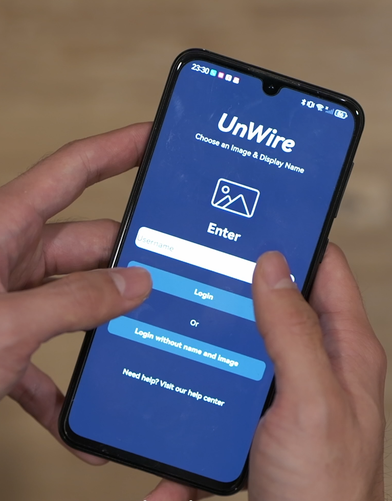
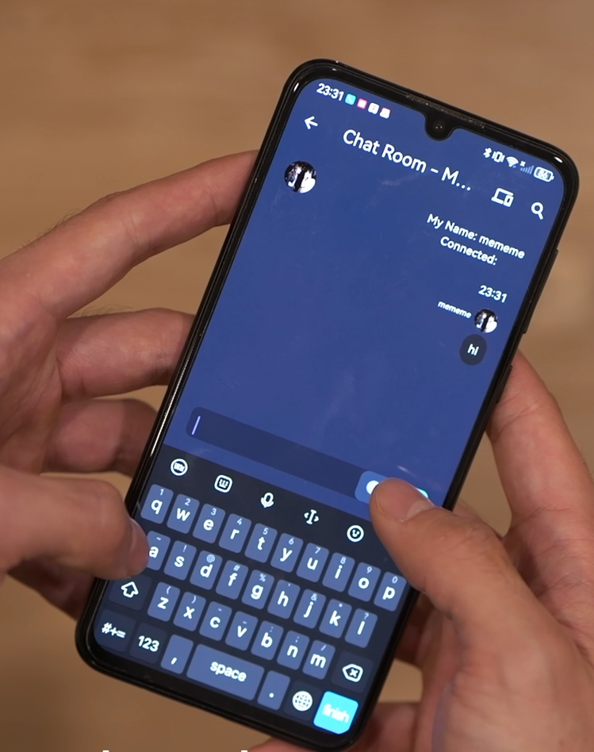
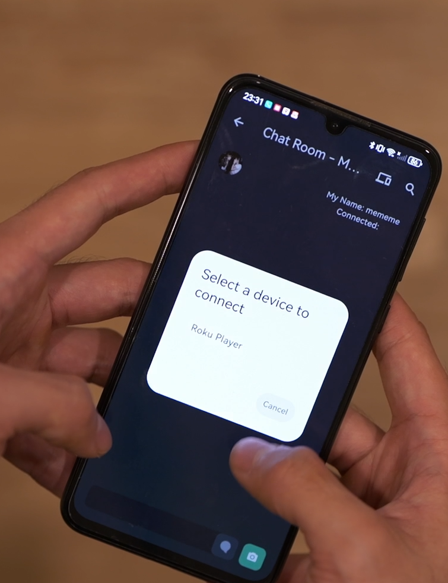

# UnWire

## Overview

[intro video](https://drive.google.com/file/d/1g9vX-2V3WXsn7yhl7o_0M68zWBeZYGGh/view?usp=sharing)

**UnWire** is a mobile messaging app that enables real-time text and photo sharing between nearby devices **without an internet connection**. It creates a local peer-to-peer network so users can chat and share images with others in the vicinity (on the same local network or direct Wi-Fi connection). This makes UnWire ideal for everyday users who want to communicate in places with limited or no internet access, or who prefer local offline communication. The app is currently in **early development** (prototype stage), and while fully functional on Android, cross-platform support (iOS and others) is planned for future releases. UnWire is designed for **end users (not developers)**, offering a simple and intuitive interface to connect and chat with friends or colleagues nearby.

## Features

- **Offline Messaging:** Exchange text messages in real-time with nearby devices without needing cellular data or Wi-Fi internet. All communication happens over a local network or direct device-to-device connection.  
- **Photo Sharing:** Send and receive images (photo messages) instantly to peers around you. The app supports sharing photos in the chat, making group conversations more engaging even when offline.  
- **Multi-Device Group Chat:** Create or join a local chat session with up to **20 devices** connected at once. UnWire automatically discovers and connects to peers on the same local network, enabling a group conversation without any central server.  
- **Easy Setup & Profile:** Start by choosing a display name and an optional profile image on the login screen. This friendly onboarding allows users to personalize their identity (or proceed anonymously without a name/image) before entering the chat.  
- **User-Friendly Interface:** The chat room interface is clean and simple – showing the list of messages and a text input bar with attachments. It behaves like a familiar messaging app, so anyone can use it without technical knowledge. Notifications within the app show when new devices connect or disconnect, keeping the user informed.  
- **Cross-Platform Support (Planned):** Currently supported on Android devices. **iOS support is on the roadmap**, leveraging the same Flutter codebase to expand UnWire’s reach. The underlying technology is cross-platform capable, so future versions will allow Android and iOS users to chat together locally.  
- **No Internet Required:** Great for scenarios like traveling, remote areas, underground events, or anywhere you might not have internet. UnWire lets you stay connected with people nearby — completely off the grid. (All messages stay within the local network, enhancing privacy and reducing reliance on external infrastructure.)

## Screenshots

  
*Figure: Login screen of UnWire. Users pick a display name and profile picture or tap “Login without name and image” for anonymity.*

  
*Figure: Chat Room interface. Messages appear instantly, and the bottom bar lets you type text or send photos.*

  
*Figure: Device discovery and connection. UnWire lists nearby peers and lets you select who to join.*

## Technical Details

UnWire is built with **Flutter (Dart)**, allowing for a flexible UI and cross-platform potential from a single codebase. The app relies on the Flutter plugin **[`nearby_service`](https://pub.dev/packages/nearby_service)** for establishing peer-to-peer connections between devices. This plugin handles the low-level networking, using technologies like Wi-Fi Direct and local network service discovery to connect devices directly. As a result, UnWire doesn’t require any external server – devices communicate **peer-to-peer**, creating a local mesh network for the chat.

Key technical aspects include:

1. **Peer Discovery**  
   Devices broadcast and scan for peers in the vicinity. On Android, the app requests necessary permissions (e.g., location for Wi-Fi discovery) and then uses `nearby_service` to find other UnWire users on the same Wi-Fi or direct range. Users can select a device to connect or auto-connect if configured.

2. **Real-Time Communication**  
   Once a connection is established, a communication channel is set up between the devices. Text messages are sent as data packets and displayed instantly. Photo messages are transmitted as file streams. The plugin ensures reliable delivery.

3. **Group Session Management**  
   Supports up to 20 devices in one chat session. Under the hood, one device may act as a host (or the network can form a mesh) and others join. The app keeps track of connected peers and updates the UI when devices join or leave.

4. **Cross-Platform Architecture**  
   While the current version targets Android (APK), the Flutter codebase and `nearby_service` plugin are already cross-platform. Adding iOS support will primarily involve handling iOS-specific permissions and testing on Apple devices.

5. **Early Development Status**  
   UnWire’s codebase is evolving. The focus so far has been on core functionality (local messaging and file transfer). Future enhancements may include encryption, refined discovery, UI/UX improvements, and publishing to app stores.

## License

This project is licensed under the **MIT License**.  
See the [LICENSE](LICENSE) file for details.
